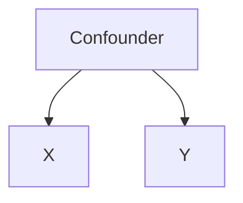
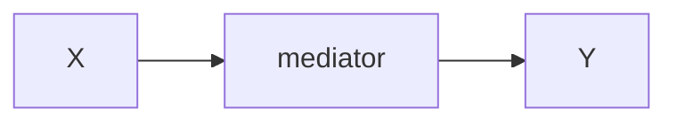
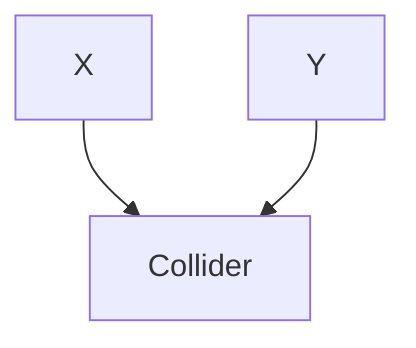

https://www.researchgate.net/publication/322778777_Thinking_Clearly_About_Correlations_and_Causation_Graphical_Causal_Models_for_Observational_Data

---
Control:

---
Don't control:

---
[[collider bias]]
Don't control:

---

- Randomized experiments are gold standard but often not possible/feasible/ethical